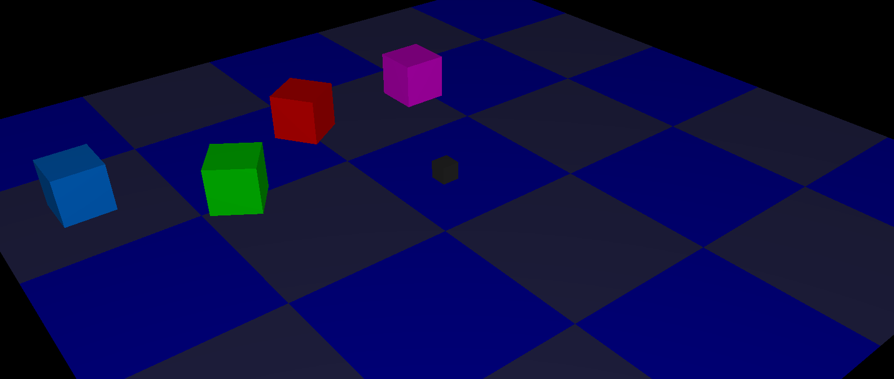
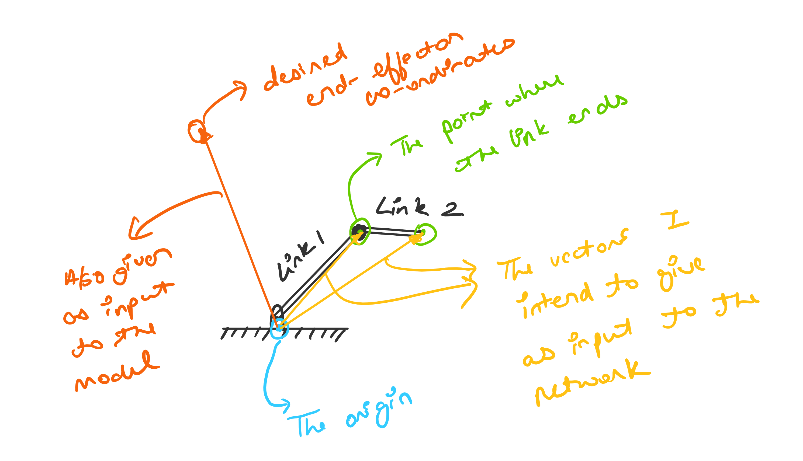
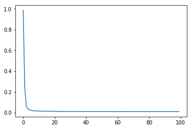
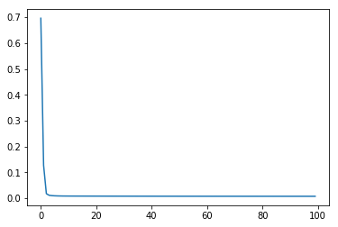
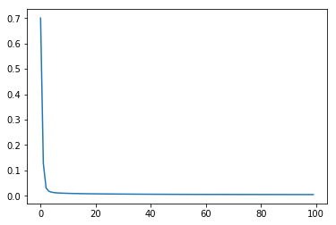
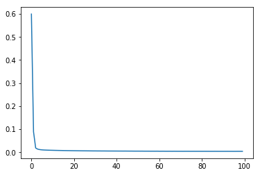
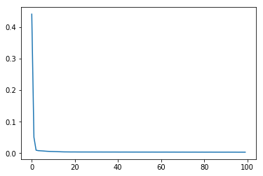

# Intelligent Robotics Project

- Dhruv Dhamani
- ddhamani@uncc.edu


```python
import torch
import torch.nn as nn
import torchvision
%pylab inline

import numpy as np
import pandas as pd
import os
from tqdm import tqdm

from quaternion_layers import *

device = "cuda:0" if torch.cuda.is_available() else "cpu"
```

    Populating the interactive namespace from numpy and matplotlib
    

## The Robot

First let's take a look at the robot arm we'll be working with -

```
fixed [⚓]
    torso_linear [↕+Z]
        shoulder_yaw [⚙+Z]
            elbow_yaw [⚙+Z]
                wrist_yaw [⚙+Z]
```

> - Fixed joint shown by ⚓
> - Linear joint along the Z-axis shown by ↕+Z
> - Rotational joint along the Z-axis shown by ⚙+Z

I had trouble coming up with a good configuration for a robot arm with enough "reach" to be able to produce a nice and varied dataset, and this was the best I could come up with at the time.

This is what it looks like -


And this is how it can move -



## The Data

To quote my project proposal, I had said -

> A 2R, 3R, and 4R robotic arm would be simulated using ROS and Gazebo. The user would input either via console or through a web interface the desired co-ordinates for the end-effector.
>
> __The desired end-effector co-ordinates would be fed into a neural network as in the form of a quaternion that describes the transformation required to go from the origin to the desired end-effector co-ordinates, along with the quaternions describing the current orientation of each link in the robotic arm.__

As such the data we need to gather is -

- Desired end-effector co-ordinates
- A vector for each link that goes from the origin to the end of that link as shown below (as a quaternion)
> 
- A quaternion for the initial orientation of the link

These would be the input to the network; for training, we also need the corresponding outputs, which would be -

- The translation needed to be made for each link, as a quaternion.
- The rotation needed to be made for each link, as a quaternion.

I computed all of this data by writing a script in Rust, using a kinematics library called [k](https://github.com/OTL/k). The data computed was written to a `JSON` file, as an array of `JSON` objects, each representing one input-output pair. One such input-output pair is detailed below -

```json
{
    "l0": [-0.0008749962, 1.0989358, 0.10087502],
    "l1": [-0.00087475777, 1.098697, 0.4008749],
    "l2": [0.047727853, 1.0989714, 0.10483825],
    "l3": [-0.24934354, 1.0987016, 0.14665347],
    "l0_rot": [-0.49960187, -0.49999982, -0.49999982, 0.5003981],
    "l1_rot": [-0.53895015, 0.45731235, 0.45810595, 0.5390149],
    "l2_rot": [-0.04910004, -0.7051177, -0.7056401, 0.049701005],
    "l3_rot": [-0.49960187, -0.49999973, -0.49999982, 0.50039816],
    "l0_final": [-0.000079125166, 0.09939951, 0.100079186],
    "l1_final": [-0.00007888675, 0.09916064, 0.40007907],
    "l2_final": [0.009956747, 0.099407375, 0.100247085],
    "l3_final": [-0.14984122, 0.09948231, -0.15365165],
    "l0_rot_final": [-0.49960187, -0.49999982, -0.49999982, 0.5003981],
    "l1_rot_final": [-0.5082875, 0.49116763, 0.49196374, 0.50830084],
    "l2_rot_final": [0.34192163, -0.6186206, -0.6193856, -0.34170097],
    "l3_rot_final": [-0.49960193, -0.4999997, -0.49999976, 0.50039816],
    "l0_trans": [-0.00015924126, 0.19999987, 0.00015926361],
    "l1_trans": [-0.000079125166, 0.09939951, 0.100079186],
    "l2_trans": [-0.00007888675, 0.09916064, 0.40007907],
    "l3_trans": [0.009956747, 0.099407375, 0.100247085],
    "l0_rot_trans": [-0.49960187, -0.49999982, -0.49999982, 0.5003981],
    "l1_rot_trans": [-0.49960187, -0.49999982, -0.49999982, 0.5003981],
    "l2_rot_trans": [-0.5082875, 0.49116763, 0.49196374, 0.50830084],
    "l3_rot_trans": [0.34192163, -0.6186206, -0.6193856, -0.34170097],
    "a_joint_pos": [0.7990161, 2.978866, -4.409823, 1.4309571],
    "b_joint_pos": [-0.20052081, 3.1081338, -5.6879864, 2.5798528]
}
```

The following piece of code reads the aforementioned `JSON` file and makes a pandas dataframe out of it, which we will then convert to PyTorch tensors and feed them into the network.


```python
data = pd.read_json('DATA.json')

data['l0'] = data['l0'].apply(lambda x: np.array([0.0] + x))
data['l1'] = data['l1'].apply(lambda x: np.array([0.0] + x))
data['l2'] = data['l2'].apply(lambda x: np.array([0.0] + x))
data['l3'] = data['l3'].apply(lambda x: np.array([0.0] + x))
data['l0_rot'] = data['l0_rot'].apply(np.array)
data['l1_rot'] = data['l1_rot'].apply(np.array)
data['l2_rot'] = data['l2_rot'].apply(np.array)
data['l3_rot'] = data['l3_rot'].apply(np.array)

data['l0_final'] = data['l0_final'].apply(lambda x: np.array([0.0] + x))
data['l1_final'] = data['l1_final'].apply(lambda x: np.array([0.0] + x))
data['l2_final'] = data['l2_final'].apply(lambda x: np.array([0.0] + x))
data['l3_final'] = data['l3_final'].apply(lambda x: np.array([0.0] + x))
data['l0_rot_final'] = data['l0_rot_final'].apply(np.array)
data['l1_rot_final'] = data['l1_rot_final'].apply(np.array)
data['l2_rot_final'] = data['l2_rot_final'].apply(np.array)
data['l3_rot_final'] = data['l3_rot_final'].apply(np.array)

data['l0_trans'] = data['l0_trans'].apply(lambda x: np.array([0.0] + x))
data['l1_trans'] = data['l1_trans'].apply(lambda x: np.array([0.0] + x))
data['l2_trans'] = data['l2_trans'].apply(lambda x: np.array([0.0] + x))
data['l3_trans'] = data['l3_trans'].apply(lambda x: np.array([0.0] + x))
data['l0_rot_trans'] = data['l0_rot_trans'].apply(np.array)
data['l1_rot_trans'] = data['l1_rot_trans'].apply(np.array)
data['l2_rot_trans'] = data['l2_rot_trans'].apply(np.array)
data['l3_rot_trans'] = data['l3_rot_trans'].apply(np.array)

# data = data[ ['l0', 'l1', 'l2', 'l3', 'l3_final',
#               'l0_rot', 'l1_rot', 'l2_rot', 'l3_rot', 'l3_rot_final',
#             'l0_trans', 'l1_trans', 'l2_trans',
#              'l0_rot_trans', 'l1_rot_trans', 'l2_rot_trans',
#               'l0_trans', 'l1_trans', 'l2_trans',
#              'l0_rot_trans', 'l1_rot_trans', 'l2_rot_trans'] ]

_data = data[ ['l0', 'l1', 'l2', 'l3', 'l3_final',
              'l0_rot', 'l1_rot', 'l2_rot', 'l3_rot',
              'l0_trans', 'l1_trans', 'l2_trans', 'l3_trans',
             'l0_rot_trans', 'l1_rot_trans', 'l2_rot_trans', 'l3_rot_trans'] ]
_data.head()
```


<div>
<style scoped>
    .dataframe tbody tr th:only-of-type {
        vertical-align: middle;
    }

    .dataframe tbody tr th {
        vertical-align: top;
    }

    .dataframe thead th {
        text-align: right;
    }
</style>
<table border="1" class="dataframe">
  <thead>
    <tr style="text-align: right;">
      <th></th>
      <th>l0</th>
      <th>l1</th>
      <th>l2</th>
      <th>l3</th>
      <th>l3_final</th>
      <th>l0_rot</th>
      <th>l1_rot</th>
      <th>l2_rot</th>
      <th>l3_rot</th>
      <th>l0_trans</th>
      <th>l1_trans</th>
      <th>l2_trans</th>
      <th>l3_trans</th>
      <th>l0_rot_trans</th>
      <th>l1_rot_trans</th>
      <th>l2_rot_trans</th>
      <th>l3_rot_trans</th>
    </tr>
  </thead>
  <tbody>
    <tr>
      <th>0</th>
      <td>[0.0, -0.00019985437, 0.2510149, 0.10019991]</td>
      <td>[0.0, -0.00019961595999999998, 0.25077602, 0.4...</td>
      <td>[0.0, 0.034441292000000005, 0.25056633, 0.698193]</td>
      <td>[0.0, -0.24929011, 0.25026283, 0.7956424400000...</td>
      <td>[0.0, 0.14988443, -0.14983344, -0.103550166000...</td>
      <td>[-0.49960187, -0.49999982, -0.49999982, 0.5003...</td>
      <td>[-0.52768135, -0.4702704, -0.47022435, 0.52847...</td>
      <td>[-0.11611071, -0.6972231999999999, -0.69768584...</td>
      <td>[-0.4996019, -0.4999998, -0.4999998, 0.50039816]</td>
      <td>[0.0, -0.00015924125999999998, 0.19999987, 0.0...</td>
      <td>[0.0, 0.000119552016, -0.15011469, 0.09988052]</td>
      <td>[0.0, 0.000119790435, -0.15035355, 0.399880399...</td>
      <td>[0.0, 0.21400562, -0.15001574, 0.18951705]</td>
      <td>[-0.49960187, -0.49999982, -0.49999982, 0.5003...</td>
      <td>[-0.49960187, -0.49999982, -0.49999982, 0.5003...</td>
      <td>[-0.65424514, 0.26751652, 0.26825088, 0.65455294]</td>
      <td>[0.44339997000000003, -0.55045277, -0.5512444,...</td>
    </tr>
    <tr>
      <th>1</th>
      <td>[0.0, 0.000119552016, -0.15011469, 0.09988052]</td>
      <td>[0.0, 0.000119790435, -0.15035355, 0.399880399...</td>
      <td>[0.0, 0.21400562, -0.15001574, 0.18951705]</td>
      <td>[0.0, 0.14988443, -0.14983344, -0.103550166000...</td>
      <td>[0.0, 0.24937618, -0.15022174, -0.10424779]</td>
      <td>[-0.49960187, -0.49999982, -0.49999982, 0.5003...</td>
      <td>[-0.65424514, 0.26751652, 0.26825088, 0.65455294]</td>
      <td>[0.44339997000000003, -0.55045277, -0.5512444,...</td>
      <td>[-0.49960193, -0.49999976, -0.4999997300000000...</td>
      <td>[0.0, -0.00015924125999999998, 0.19999987, 0.0...</td>
      <td>[0.0, 0.000119924545, -0.15058279, 0.09988013]</td>
      <td>[0.0, 0.000120162964, -0.15082166, 0.39988002]</td>
      <td>[0.0, 0.21847203, -0.15048397, 0.1941560700000...</td>
      <td>[-0.49960187, -0.49999982, -0.49999982, 0.5003...</td>
      <td>[-0.49960187, -0.49999982, -0.49999982, 0.5003...</td>
      <td>[-0.6570787, 0.26047919999999997, 0.26121026, ...</td>
      <td>[0.5251017, -0.473149, -0.47394422, -0.5251428]</td>
    </tr>
    <tr>
      <th>2</th>
      <td>[0.0, 0.000119924545, -0.15058279, 0.09988013]</td>
      <td>[0.0, 0.000120162964, -0.15082166, 0.39988002]</td>
      <td>[0.0, 0.21847203, -0.15048397, 0.1941560700000...</td>
      <td>[0.0, 0.24937618, -0.15022174, -0.10424779]</td>
      <td>[0.0, -0.24936235, -0.050322868, -0.10379206]</td>
      <td>[-0.49960187, -0.49999982, -0.49999982, 0.5003...</td>
      <td>[-0.6570787, 0.26047919999999997, 0.26121026, ...</td>
      <td>[0.5251017, -0.473149, -0.47394422, -0.5251428]</td>
      <td>[-0.4996019, -0.49999976, -0.49999976, 0.50039...</td>
      <td>[0.0, -0.00015924125999999998, 0.19999987, 0.0...</td>
      <td>[0.0, 4.0054319999999995e-05, -0.0502865, 0.09...</td>
      <td>[0.0, 4.029274e-05, -0.050525367, 0.39995986]</td>
      <td>[0.0, -0.030634344, -0.05031219, 0.10153228]</td>
      <td>[-0.49960187, -0.49999982, -0.49999982, 0.5003...</td>
      <td>[-0.49960187, -0.49999982, -0.49999982, 0.5003...</td>
      <td>[-0.473769, 0.52454245, 0.52533764, 0.47372824]</td>
      <td>[0.26040164, -0.6571095, -0.6578402, -0.26008534]</td>
    </tr>
    <tr>
      <th>3</th>
      <td>[0.0, 4.0054319999999995e-05, -0.0502865, 0.09...</td>
      <td>[0.0, 4.029274e-05, -0.050525367, 0.39995986]</td>
      <td>[0.0, -0.030634344, -0.05031219, 0.10153228]</td>
      <td>[0.0, -0.24936235, -0.050322868, -0.10379206]</td>
      <td>[0.0, -0.15061736, -0.05022552, -0.10425120600...</td>
      <td>[-0.49960187, -0.49999982, -0.49999982, 0.5003...</td>
      <td>[-0.473769, 0.52454245, 0.52533764, 0.47372824]</td>
      <td>[0.26040164, -0.6571095, -0.6578402, -0.26008534]</td>
      <td>[-0.49960196, -0.49999976, -0.4999998, 0.5003982]</td>
      <td>[0.0, -0.00015924125999999998, 0.19999987, 0.0...</td>
      <td>[0.0, 4.0039419999999996e-05, -0.0502681730000...</td>
      <td>[0.0, 4.027784e-05, -0.05050704, 0.3999599]</td>
      <td>[0.0, 0.06279153, -0.050223485000000005, 0.106...</td>
      <td>[-0.49960187, -0.49999982, -0.49999982, 0.5003...</td>
      <td>[-0.49960187, -0.49999982, -0.49999982, 0.5003...</td>
      <td>[-0.5497696400000001, 0.4442468, 0.44503862, 0...</td>
      <td>[0.26877823, -0.6537278999999999, -0.6544626, ...</td>
    </tr>
    <tr>
      <th>4</th>
      <td>[0.0, 4.0039419999999996e-05, -0.0502681730000...</td>
      <td>[0.0, 4.027784e-05, -0.05050704, 0.3999599]</td>
      <td>[0.0, 0.06279153, -0.050223485000000005, 0.106...</td>
      <td>[0.0, -0.15061736, -0.05022552, -0.10425120600...</td>
      <td>[0.0, -0.05064021, -0.05022476, -0.10428929]</td>
      <td>[-0.49960187, -0.49999982, -0.49999982, 0.5003...</td>
      <td>[-0.5497696400000001, 0.4442468, 0.44503862, 0...</td>
      <td>[0.26877823, -0.6537278999999999, -0.6544626, ...</td>
      <td>[-0.4996019, -0.49999988, -0.49999988, 0.5003981]</td>
      <td>[0.0, -0.00015924125999999998, 0.19999987, 0.0...</td>
      <td>[0.0, 4.0099025e-05, -0.05034703, 0.09995994]</td>
      <td>[0.0, 4.0337443e-05, -0.050585896000000005, 0....</td>
      <td>[0.0, 0.1344908, -0.050265312000000006, 0.1317...</td>
      <td>[-0.49960187, -0.49999982, -0.49999982, 0.5003...</td>
      <td>[-0.49960187, -0.49999982, -0.49999982, 0.5003...</td>
      <td>[-0.60160756, 0.37103929999999996, 0.37181413,...</td>
      <td>[0.30952302, -0.6354504999999999, -0.63620305,...</td>
    </tr>
  </tbody>
</table>
</div>


The columns -

- `l0`
- `l1`
- `l2`
- `l3`
- `l0_rot`
- `l1_rot`
- `l2_rot`
- `l3_rot`
- `l3_final`

will be given to the network as input, and we'll expect the following as output -

- `l0_trans`
- `l1_trans`
- `l2_trans`
- `l3_trans`
- `l0_rot_trans`
- `l1_rot_trans`
- `l2_rot_trans`
- `l3_rot_trans`


```python
_data = np.array([np.hstack(list(x)) for x in list(_data.values)])
_data.shape
```


    (136446, 68)


We have `136,446` input-output samples of data.


```python
def train(_data, model):
    loss = torch.nn.MSELoss()
    optimizer = torch.optim.Adam(model.parameters(), lr=0.01, amsgrad=True)
    
    _data = torch.tensor(_data).float()
    dataset = torch.utils.data.TensorDataset(_data)

    train_batches = torch.utils.data.DataLoader(
        dataset,
        batch_size=4084,
        shuffle=True,
        pin_memory=True
    )
    model.to(device)
    
    print(model)
    
    train_errors = []
    for epoch in tqdm(range(100)):
        errors = []
        for batch in train_batches:
            batch = batch[0].to(device)
            x = batch.narrow(1, 0, 36)
            y = batch.narrow(1, 36, 32)

            optimizer.zero_grad()
            pred = model(x)
            error = loss(pred, y)

            if not epoch == 0:
                error.backward()
                optimizer.step()

            errors.append(error.data.item())

        train_errors.append(np.mean(errors))
    
    return train_errors, train_batches
```

## Experiment - 1

- A single Quaternion Linear Layer (`9 quaternions input -> 8 quaternions output`)


```python
model = nn.Sequential(QuaternionLinearAutograd(36, 32))
loss_curve, _ = train(_data, model)
plot(loss_curve)
```

    Sequential(
      (0): QuaternionLinearAutograd(in_features=9, out_features=8, bias=True, init_criterion=glorot, weight_init=quaternion, seed=1112)
    )
    

    100%|███████████████████████████████████████████████████████████████████████████████████████████████████████████████████████████| 100/100 [04:04<00:00,  2.52s/it]
    


    [<matplotlib.lines.Line2D at 0x21dc43c5748>]





```python
loss_curve
```


    [0.986152123002445,
     0.2368584047345554,
     0.05968216587515438,
     0.03567931198460214,
     0.02652234474525732,
     0.021952509660931194,
     0.019351086360128486,
     0.01769569784621982,
     0.01656747828511631,
     0.015746465281528586,
     0.015109013574307455,
     0.01458377024049268,
     0.014166720375856933,
     0.013820498962612712,
     0.013551476521088797,
     0.013257118188502157,
     0.013060236431877403,
     0.012852968675467898,
     0.012670425013365114,
     0.012520903611884397,
     0.012369291172088945,
     0.012257742914645112,
     0.012124518973424155,
     0.012018682325587553,
     0.011947989189887749,
     0.01183365737361943,
     0.011756880318417269,
     0.011689543066655888,
     0.011624884490361986,
     0.011556160143193077,
     0.011481914231005837,
     0.011442565249607843,
     0.011397028122754657,
     0.011335667113170904,
     0.011283821125021753,
     0.011273231987348375,
     0.011200207422542222,
     0.011174608706770575,
     0.011120990055668004,
     0.011117238277459847,
     0.011093359741875353,
     0.011038905858774395,
     0.01100745375322945,
     0.010994048871319084,
     0.010950398877920473,
     0.01094581778435146,
     0.010915991274968666,
     0.010905670056886533,
     0.010877651326796588,
     0.010852692730943947,
     0.01084841916556744,
     0.01082376141429824,
     0.010805864078814493,
     0.01077498895499636,
     0.01076501076493193,
     0.010752176592016922,
     0.010734438512693434,
     0.010737747282666318,
     0.010716543532907963,
     0.010701483937309068,
     0.010686827768736026,
     0.010681208606590243,
     0.010673078270081212,
     0.010677565765731475,
     0.010653222308439366,
     0.010644585058531341,
     0.010642239193925086,
     0.010632648543619058,
     0.010603149120202836,
     0.0106283373418538,
     0.010607976658160196,
     0.010597313261207412,
     0.010591579601168633,
     0.01058488730889033,
     0.010576217216165626,
     0.010547114426598829,
     0.010565758271909812,
     0.010574761230279417,
     0.010556507554343519,
     0.010552282034255126,
     0.010559922138995984,
     0.010556317400187254,
     0.01051142146153485,
     0.010520699461374213,
     0.010519459377974272,
     0.010520277627031593,
     0.010494776754913962,
     0.010506831958670826,
     0.010499108747086105,
     0.010504020432777265,
     0.010498044491909882,
     0.010489718933754107,
     0.010493639527874835,
     0.010479091940557255,
     0.010472161914495862,
     0.0104904868913924,
     0.010473219129969092,
     0.010467360974015558,
     0.010487866177059272,
     0.010469686787794618]


## Experiment - 2

- A single Linear Layer (`36 neurons input -> 32 neurons output`)


```python
model = nn.Sequential(nn.Linear(36, 32))
loss_curve, _ = train(_data, model)
plot(loss_curve)
```

    Sequential(
      (0): Linear(in_features=36, out_features=32, bias=True)
    )
    

    100%|███████████████████████████████████████████████████████████████████████████████████████████████████████████████████████████| 100/100 [04:10<00:00,  2.43s/it]
    


    [<matplotlib.lines.Line2D at 0x21dc43a4f28>]





```python
loss_curve
```


    [0.6961357540944043,
     0.1277247665121275,
     0.017848176580360708,
     0.011656587779083672,
     0.010295450906543172,
     0.009626669097034371,
     0.009234811864135897,
     0.008998205063535887,
     0.00883806957041516,
     0.008757768664509058,
     0.008674929233487038,
     0.008630803868393688,
     0.008597744053558391,
     0.008568069705849184,
     0.008559234905987978,
     0.008539102040231228,
     0.008496531394912916,
     0.008482503649943015,
     0.008468611850677168,
     0.0084363707642564,
     0.008392463205382228,
     0.008404746679041316,
     0.008370248819975293,
     0.008347262231194797,
     0.008327387437662658,
     0.008317987160647617,
     0.008284992100123097,
     0.008276611114578211,
     0.00825809468241299,
     0.008245306870187907,
     0.008220543783596334,
     0.008213697727221777,
     0.008191911298233797,
     0.0081790333668537,
     0.008172581410583328,
     0.008135043563978636,
     0.008130770245128694,
     0.008112591540660052,
     0.008100147701471168,
     0.008082948652479579,
     0.008088587660013753,
     0.008062657653628028,
     0.008035115883959568,
     0.008031446212793098,
     0.008037235108478105,
     0.008026150589370552,
     0.00801415227846626,
     0.007990884526139674,
     0.00799490199150408,
     0.007992539335699642,
     0.007958530818166979,
     0.00795279792509973,
     0.007950917666997103,
     0.007945361560867989,
     0.007947011344025241,
     0.00793238149901085,
     0.007921579198035248,
     0.007912321564029245,
     0.007906501715564552,
     0.007897652083021752,
     0.007892324561801027,
     0.007895895636037868,
     0.007859488127424437,
     0.007887378471958287,
     0.007855288862415096,
     0.007853892125079738,
     0.00786541765281821,
     0.007856967461788478,
     0.007841414046090315,
     0.00786130509667975,
     0.007851362680358923,
     0.007843551061609211,
     0.007845936356769764,
     0.007817156284170993,
     0.007817397934987265,
     0.0078098784776075795,
     0.007817657376803896,
     0.007818766924388269,
     0.007803790079539313,
     0.0078092080349212185,
     0.00779493443448754,
     0.007809588137794943,
     0.007785964962642859,
     0.00780522812377004,
     0.007782130721299087,
     0.007789943901383702,
     0.007785777301144074,
     0.007784320000449524,
     0.007771506111192352,
     0.007770315483760308,
     0.007766653304262196,
     0.007759088129900834,
     0.007754348382792052,
     0.0077764961649389825,
     0.007764776524923304,
     0.007774298490189454,
     0.0077714372344095915,
     0.007742976400015109,
     0.007762465434258475,
     0.007777250084259054]


## Experiment - 3

1. Quaternion Linear Layer (`9 quaternions input -> 10 quaternions output`)
2. ELU activation.
3. Quaternion Linear Layer (`10 quaternions input -> 8 quaternions output`)


```python
model = nn.Sequential(
    QuaternionLinearAutograd(36, 40),
    nn.ELU(),
    QuaternionLinearAutograd(40, 32)
)
loss_curve, _ = train(_data, model)
plot(loss_curve)
```

    Sequential(
      (0): QuaternionLinearAutograd(in_features=9, out_features=10, bias=True, init_criterion=glorot, weight_init=quaternion, seed=16)
      (1): ELU(alpha=1.0)
      (2): QuaternionLinearAutograd(in_features=10, out_features=8, bias=True, init_criterion=glorot, weight_init=quaternion, seed=812)
    )
    

    100%|███████████████████████████████████████████████████████████████████████████████████████████████████████████████████████████| 100/100 [04:29<00:00,  2.87s/it]
    


    [<matplotlib.lines.Line2D at 0x21dae94cef0>]





```python
loss_curve
```


    [0.6998992404517006,
     0.12822098953320699,
     0.030986769398783937,
     0.01827019696836086,
     0.014580334180637318,
     0.012843650464406785,
     0.011851914528319064,
     0.011207187000442953,
     0.010748690405093572,
     0.010343435384771404,
     0.010038840200971155,
     0.009734360775088562,
     0.00948428047601791,
     0.009251174763502443,
     0.009043739971649997,
     0.008838466094697224,
     0.008660778074580081,
     0.008516683517133488,
     0.008376131806632174,
     0.008216055808588862,
     0.00812964845339165,
     0.007996211362564388,
     0.007883172879433808,
     0.007772794212488567,
     0.007692442727549111,
     0.007586487500435289,
     0.007525661960244179,
     0.0074337767163182005,
     0.007350209799102124,
     0.007274761617950657,
     0.007202370900332052,
     0.007133643293534131,
     0.007070556652786977,
     0.007001456818269456,
     0.006932493312941755,
     0.0068684721447746545,
     0.006796826457823901,
     0.006731509751475909,
     0.006678657592548167,
     0.006636147674940088,
     0.006564837962608127,
     0.006511765997856855,
     0.006461161298348624,
     0.006427806076210211,
     0.006354283459265442,
     0.006323671954519609,
     0.006287563633283272,
     0.006245004684280823,
     0.006203523631591131,
     0.006162540192770607,
     0.006131131777211148,
     0.006080326966612655,
     0.0060610603404176585,
     0.006054841433925664,
     0.006011319059111616,
     0.00595988637274679,
     0.005958708249689902,
     0.0059225247241556644,
     0.005903343820725293,
     0.005871022161205902,
     0.005834729095701785,
     0.0058238756541601,
     0.005797940361149171,
     0.005795579458422521,
     0.005765828988788759,
     0.005737587220638114,
     0.005712798741810462,
     0.005703149596229196,
     0.0056929219212821305,
     0.005692791344378801,
     0.005666661898002905,
     0.0056573650662732474,
     0.005603993544355035,
     0.005606788580360658,
     0.005590485710212413,
     0.005596898852244896,
     0.005563192014746806,
     0.0055522487416644305,
     0.005537739585098975,
     0.005535665844731471,
     0.005508702357902247,
     0.005507048137266846,
     0.005470115595551974,
     0.00545527775059728,
     0.005465171217699261,
     0.005441552603288609,
     0.005418217768344809,
     0.005413325037807226,
     0.005409703589975834,
     0.005382953745806042,
     0.0053862529560266175,
     0.005348489838926231,
     0.005344185854910928,
     0.0053323107798967295,
     0.0053441177314037785,
     0.005309924428515574,
     0.005314543254344779,
     0.005283399827449638,
     0.0052749566898188174,
     0.005251377369003261]


## Experiment - 4

1. Quaternion Linear Layer (`9 quaternions input -> 18 quaternions output`)
2. ELU activation.
3. Quaternion Linear Layer (`18 quaternions input -> 8 quaternions output`)


```python
model = nn.Sequential(
    QuaternionLinearAutograd(36, 72),
    nn.ELU(),
    QuaternionLinearAutograd(72, 32)
)
loss_curve, _ = train(_data, model)
plot(loss_curve)
```

    Sequential(
      (0): QuaternionLinearAutograd(in_features=9, out_features=18, bias=True, init_criterion=glorot, weight_init=quaternion, seed=1151)
      (1): ELU(alpha=1.0)
      (2): QuaternionLinearAutograd(in_features=18, out_features=8, bias=True, init_criterion=glorot, weight_init=quaternion, seed=1131)
    )
    

    100%|███████████████████████████████████████████████████████████████████████████████████████████████████████████████████████████| 100/100 [05:06<00:00,  3.13s/it]
    


    [<matplotlib.lines.Line2D at 0x21dae9ef8d0>]





```python
loss_curve
```


    [0.5994927848086637,
     0.08886091427548844,
     0.018699251033146593,
     0.013594621710260124,
     0.011631623677471104,
     0.010588998796747011,
     0.009983046254252686,
     0.009584668256780681,
     0.00924441300551681,
     0.008965311626739362,
     0.008740470114657107,
     0.008489847087356098,
     0.008282916729941088,
     0.008066133582307136,
     0.007892180590287727,
     0.007713019272641224,
     0.007554194780395311,
     0.0074010052142993495,
     0.007257164387470659,
     0.007110567270394634,
     0.006979883497800021,
     0.006861647974480601,
     0.006751525010365774,
     0.006613005870295798,
     0.006470081355313168,
     0.00641014811801998,
     0.006290620987248772,
     0.006213603842565242,
     0.006104922565795919,
     0.006024379652979619,
     0.00600840404684491,
     0.005893863806062762,
     0.005881903857430991,
     0.0057892020353499584,
     0.005789527450414265,
     0.005709070849287159,
     0.0056217447854578495,
     0.0055879187112783685,
     0.0055845681824447475,
     0.005522696315036977,
     0.005499558797215714,
     0.005417376249919043,
     0.005427693044218947,
     0.0053521492107606984,
     0.005393465611097568,
     0.005306020447546069,
     0.005254544440985602,
     0.005265700398012996,
     0.005153646185884581,
     0.005108028787243015,
     0.00513393894824035,
     0.005076153340804226,
     0.005097979118170983,
     0.004969004130757907,
     0.0049698457450551145,
     0.004960205049856621,
     0.00487235067960094,
     0.004908610162708689,
     0.004833605921115069,
     0.004937907338471097,
     0.00474029134356362,
     0.0047783195725916066,
     0.004816021920893998,
     0.004659042214317357,
     0.0046536196571062595,
     0.00471467910991872,
     0.004592334700967459,
     0.004710271666922113,
     0.004598249160848996,
     0.004550961462561698,
     0.004585201523321516,
     0.0045333139817504324,
     0.004572185619241174,
     0.0045743665164884395,
     0.004560272839358624,
     0.0044625405879581675,
     0.004565524430397679,
     0.004462419926901074,
     0.004501793622587095,
     0.004486621480763835,
     0.00444305911386276,
     0.00447718334822532,
     0.004443614627234638,
     0.004433593082734767,
     0.004364131751251133,
     0.004392322358291815,
     0.004446240559713367,
     0.004376181880669559,
     0.0043378006735378324,
     0.004353020709994084,
     0.004359823254430119,
     0.004340476041440578,
     0.004381921135491747,
     0.004317716859719332,
     0.004328934975680621,
     0.004266529453589636,
     0.004310376106706613,
     0.004396991838481934,
     0.00436300688478,
     0.004287090426420464]


## Experiment - 5

1. Linear Layer (`36 neurons input -> 72 neurons output`)
2. ELU activation.
3. Quaternion Linear Layer (`72 neurons input -> 32 neurons output`)


```python
model = nn.Sequential(
    nn.Linear(36, 72),
    nn.ELU(),
    nn.Linear(72, 32)
)
loss_curve, _ = train(_data, model)
plot(loss_curve)
```

    Sequential(
      (0): Linear(in_features=36, out_features=72, bias=True)
      (1): ELU(alpha=1.0)
      (2): Linear(in_features=72, out_features=32, bias=True)
    )
    

    100%|███████████████████████████████████████████████████████████████████████████████████████████████████████████████████████████| 100/100 [05:10<00:00,  2.97s/it]
    


    [<matplotlib.lines.Line2D at 0x21dc3a139e8>]





```python
loss_curve
```


    [0.4406554935609593,
     0.05094682819703046,
     0.009803676060126984,
     0.008327381918206811,
     0.007860258413369165,
     0.007413569577586125,
     0.006870988701634547,
     0.00634442810790942,
     0.005963136359830113,
     0.005706874338690849,
     0.005498124943936572,
     0.005329106304356281,
     0.005073142977540984,
     0.004796549664152896,
     0.004557841840912314,
     0.004377546480528134,
     0.004294636494973127,
     0.004243447616532007,
     0.004138304810861454,
     0.00414498956353568,
     0.004157040672212401,
     0.004085841465412694,
     0.00405130788738675,
     0.004018921131158576,
     0.004025966860353947,
     0.004020402837982949,
     0.004006334847551496,
     0.003973330542280832,
     0.004013155477450174,
     0.003969973350382026,
     0.003966285299290629,
     0.00394236679901095,
     0.003959921065389234,
     0.003920264863956939,
     0.003923632293556105,
     0.003929552889209898,
     0.003909661626333699,
     0.003908213618321016,
     0.0039185546954874605,
     0.0039028870626626644,
     0.0038733788738575053,
     0.0038330212084795624,
     0.003842621644520584,
     0.0038632446667179465,
     0.0038537685690885957,
     0.0038412495392977316,
     0.00379936904509497,
     0.003786977380514145,
     0.0037999787395272184,
     0.003791563390918514,
     0.0037817786968148805,
     0.003773194580229328,
     0.003782298231004354,
     0.003770866383360151,
     0.0037563663619734787,
     0.0037530595916049447,
     0.0037892624831703655,
     0.0037531758699675694,
     0.003713937209206907,
     0.0037438271717880577,
     0.003697621834683506,
     0.0037375407581053234,
     0.0037643533158937797,
     0.0037449329256025307,
     0.003669330514693523,
     0.0036873071769471556,
     0.003712779321872136,
     0.0036501581506694063,
     0.003646914443165502,
     0.0036369644666967146,
     0.0037011085352038637,
     0.0036410300458288368,
     0.003623508019646739,
     0.003607176004580277,
     0.0035727926091674495,
     0.003634456866968642,
     0.0036346051458488494,
     0.003565456656574765,
     0.0035428654416190353,
     0.0036139690508956417,
     0.0035359286703169346,
     0.0035447543281513978,
     0.003573565504184979,
     0.0036046415197608225,
     0.0035341630744583465,
     0.0034985918455811985,
     0.0035310751443509668,
     0.0035163988701670487,
     0.0034818547942182597,
     0.0034790953949970357,
     0.003488030229859492,
     0.003555999233332627,
     0.0034880095284760874,
     0.0034853933269486707,
     0.003494919222943923,
     0.0034528779523337588,
     0.0033922527629115127,
     0.003448927747633527,
     0.003425896626568454,
     0.0034207105294198673]


