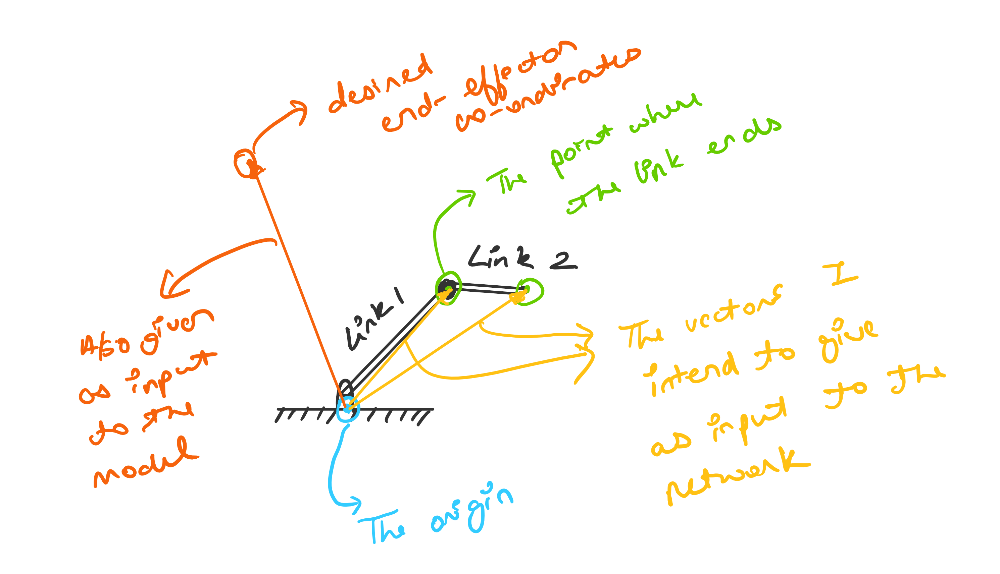
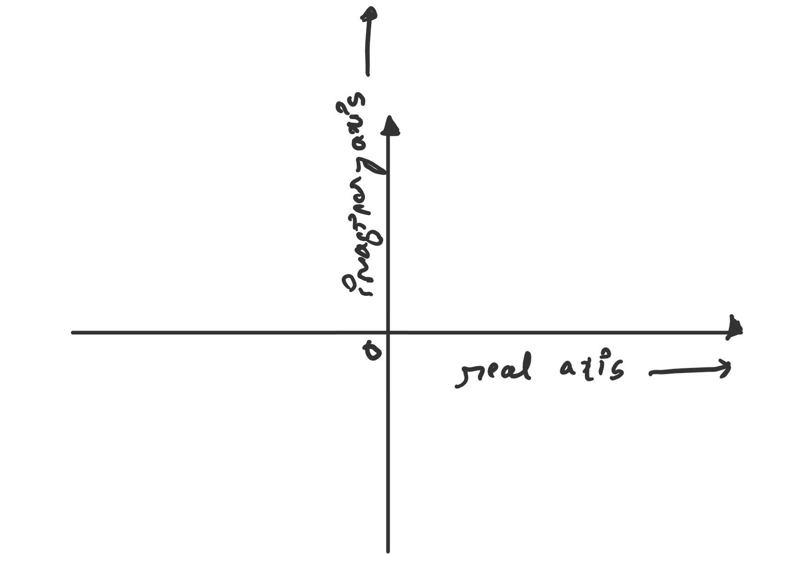
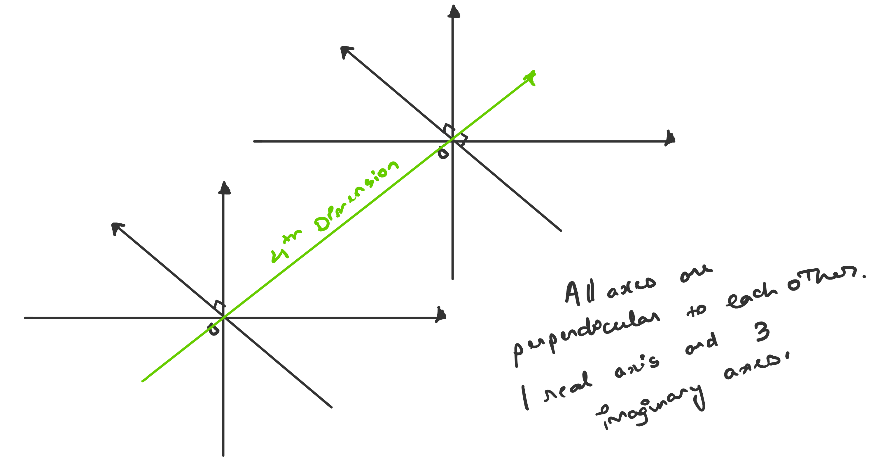
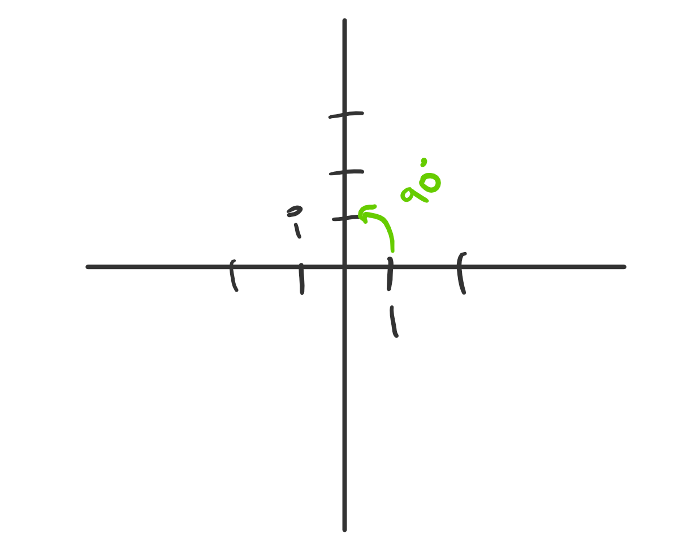

# Robotic Arm Manipulation using Quaternion Neural Networks

- Dhruv Dhamani
- ddhamani@uncc.edu

> This document is submitted as-was submitted previously, with additional information provided in boxes like these. Boxes will start by quoting annotations from the feedback received, exactly and without change. I have also addressed each annotation received in the feedback.

## Table of Contents
- [Robotic Arm Manipulation using Quaternion Neural Networks](#robotic-arm-manipulation-using-quaternion-neural-networks)
  - [Table of Contents](#table-of-contents)
  - [Introduction](#introduction)
  - [A more formal description](#a-more-formal-description)
  - [Tools used for Implementation](#tools-used-for-implementation)
  - [Milestones](#milestones)
    - [What I will definitely do](#what-i-will-definitely-do)
    - [What I am likely to do](#what-i-am-likely-to-do)
    - [What I will ideally do](#what-i-will-ideally-do)

## Introduction

Neural networks are a beautiful biologically-inspired programming paradigm which enables a computer to learn from observational data, the efficacy of which is well-documented in a variety of domains.

Most neural networks in use today operate on real-valued numbers, however the approach itself is number system agnostic. As long as we can define a suitable mathematical function for a neuron to apply on incoming values, a suitable activation function, and a suitable learning algorithm (which is almost always backpropagation), then the choice of number system used is irrelevant.

It has been found that using a number system appropriate to the task at hand can vastly simplify the complexity of network required, without adversely affecting the performance at the task.

For instance, consider a classification problem, where the scatter plot of the data looks like the figure below -

| |
|:--:|
| Class A - Purple, Class B - Yellow|

Solving this problem effectively would require a network multiple hidden layers (since it's a non-linear classification problem). If polar co-ordinates are used, the problem becomes a linear classification problem, which requires only a single hidden layer.

Less complex neural networks are preferable since they offer a lower computational complexity.

## A more formal description

A 2R, 3R, and 4R robotic arm would be simulated using ROS and Gazebo. The user would input either via console or through a web interface the desired co-ordinates for the end-effector.

The desired end-effector co-ordinates would be fed into a neural network as in the form of a quaternion that describes the transformation required to go from the origin to the desired end-effector co-ordinates, along with the quaternions describing the current orientation of each link in the robotic arm.

> **Quaternion specifies orientation, or location also? How?**
> 
> I think my choice of words caused confusion here. When I said orientation I just meant the location of the link. This is what I mean -
> 
> How the vector of the end-point of the link would be described as a quaternion is described in the next box.

The neural network would be expected to give as many output quaternions as there are links in the robotic arm, each representing what change must be made in the links location and orientation in space for the end-effector to reach the desired co-ordinates.

> **Need details of how you will use the quaternion representation**
>
> I am not well-versed with quaternion algebra, or math in general, so maybe the things I am typing next are wrong. But the way I think about quaternions is that they are just 4 dimensional numbers represented with the help of 2 complex planes, the same way the 2 X and Y axes are used to represent cartesian co-ordinates. So this is a complex plane -
> 
> And this is how I think of quaternions -
> 
> Just two *planes* instead of the usual *axis*. If you look at them this way, the obvious way to represent the three dimensional cartesian co-ordinates of the end point of a link in the first diagram is to set the 4th dimension as `0`, and use the other co-ordinates as-is.
>
> Why bother doing this, and not simply using a three dimensional vector. Because quaternion multiplication has a richer meaning than vector multiplication.
> For example, multiplying `1` by `i` rotates by `90` degrees for complex numbers.
> 
> Similarly, multiplying 2 quaternions has some meaning, which I won't pretend to understand all that well or try to draw - but I am interested in knowing whether this extra richness that I think quaternion algebra possesses will somehow make it easier for a neural network to perform this task.
> 
> So to reiterate - input would be vectors from the origin to the end point of each link, and also the vector from the origin to the desired end effector co-ordinates, represented as a quaternion with the 4th dimension set as zero. 

## Tools used for Implementation

Most work would be done in **Python**, if there is time to implement a web-interface, javascript would also be used.

Libraries and software packages to be used -
- PyTorch, a neural network framework.
- The ROS ecosystem and Gazebo
- [Code released](https://github.com/Orkis-Research/Quaternion-Recurrent-Neural-Networks) with the paper "Quaternion Recurrent Neural Networks" ([Parcollet et al., 2018](https://arxiv.org/abs/1806.04418)), which has useful abstractions for quaternion operations, and quaternion neural network layers, etc.

> **If you are using their code, what are you implementing?**
>
> The deep learning framework used by the authors of the paper is [PyTorch](https://pytorch.org/), wherein the layers of a neural network are objects constructed from a class. This class contains methods like `forward` and `backward`, which describing what operations to perform on the data flowing into that layer in the forward direction (`Input -> Output`), and the backward direction (Error and gradients from `the Ouput -> Input`) respectively. 
> 
> Inside the code released with this paper ([here](https://github.com/Orkis-Research/Quaternion-Recurrent-Neural-Networks/blob/master/quaternion_layers.py), to be specific) is a class for a Quaternion Linear Layer, which is the part I intend to use. It simply defines the `forward` and `backward` methods for a single layer of a neural network in terms of quaternion algebra, which I want to use to make my neural network.
>
> That particular class for a quaternion layer is all I intend to take from this paper, every thing else that I would need to implement to get this to work (as laid out in the milestones) would be my own work. 

## Milestones

### What I will definitely do

- Compute and create suitable training data for an 3R robotic arm.
> **Planar or spatial?**
>
> Spatial.
- Implement and train a Quaternion neural network to perform inverse kinematics for the 3R robot.
- Experiment with different neural network topologies and architecture.
- Evaluate how well it performs.
> **What is the evaluation mechanism?**
>
> So what I want the neural network to output is basically a quaternion for each link, describing how to move that link so that the end-effector reaches the desired end-effector co-ordinates.
> 
> I thought a good way to evaluate how well this is going is to simply plot the desired end-effector co-ordinates in 3D space, and also plot where the neural network would have them end up (ie., the end effector co-ordinates if you move each link the way the neural network is telling you to), and visually compare them.
>  
> If a more rigorous evaluation is required we could calculate the Euclidean distance between the desired end-effector co-ordinates, and where the neural network would have them end up.

### What I am likely to do

- Also do all of the above for 2R, and 4R robotic arms.

### What I will ideally do

- Implement a simulation that shows the arm manipulation using quaternion neural networks in action.
- Implement an interface to input desired end-effector co-ordinates.

> **Interesting problem. Need more details to understand -**
> 1. **Technical approach**
> I am not sure what details I should be providing here. I think the final project report will have enough details, since I'll be describing the whole process of what I did.
> 2. **What you would be implementing, if using software from authors of paper**
> I think I addressed this above. And also training a neural network, at least for me, is a non-trivial task involving a lot of tuning hyperparameters and waiting for it to finish running, so just that part is going to take a lot of time.
